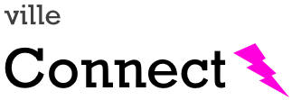
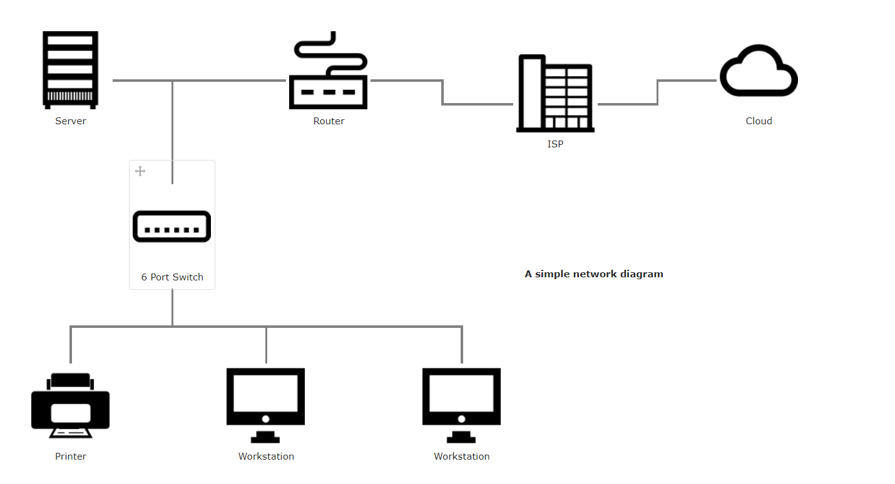
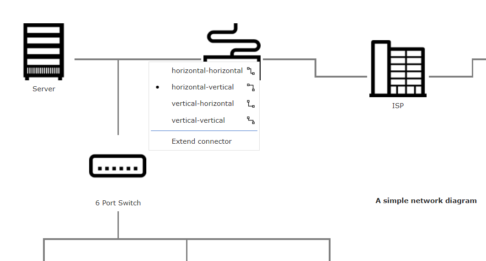

<!-- PROJECT LOGO -->
<br />
<p align="center">
  <a href="https://github.com/sqville/ville.Connect">
    
  </a>

  <h3 align="center"></h3>

  <p align="center">
    A control for the Qooxdoo JavaScript Framework
  </p>
</p>

<!-- ABOUT THE PROJECT -->
## About The Project

**ville.Connect** is a [Qooxdoo](https://qooxdoo.org/) control designed to visually connect widgets on a canvas type layout.

**Benefits**
* TBD

## The Big Idea
Create a diagramming tool using 100% Qooxdoo code and objects. No SVG or Canvas tags, if at all possible.

**Screen Shots**

Right click any connection to change its type (4 types to choose from)



<!-- GETTING STARTED -->
## Using the Control in your Application
To use the control in your application, go into the application root directory and install the library into your project:
```sh
$ qx package update
$ qx package list
$ qx package install sqville/ville.Connect
```
**Getting started**

TBD

<!-- ROADMAP -->
## Roadmap

TBD


<!-- LICENSE -->
## License

Distributed under the MIT License. See `LICENSE` for more information.


<!-- CONTACT -->
## Contact

Chris Eskew - [@SQville](https://twitter.com/SQville) - email: chris.eskew@sqville.com

## Attribution
Inspired by and learned from this project: [jqSimpleConnect](https://github.com/jfmdev/jqSimpleConnect)